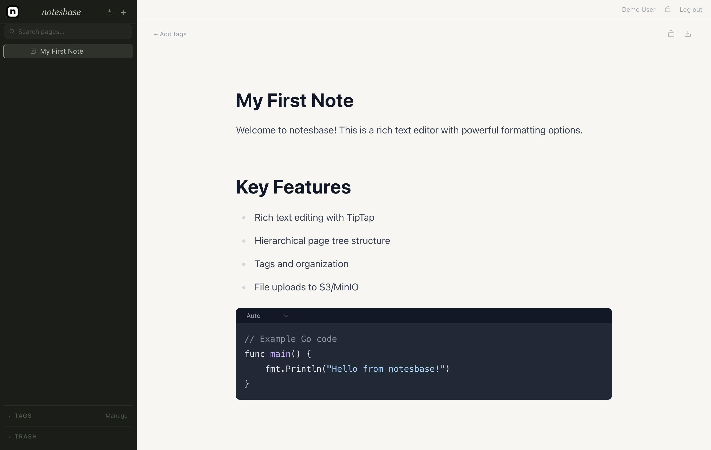
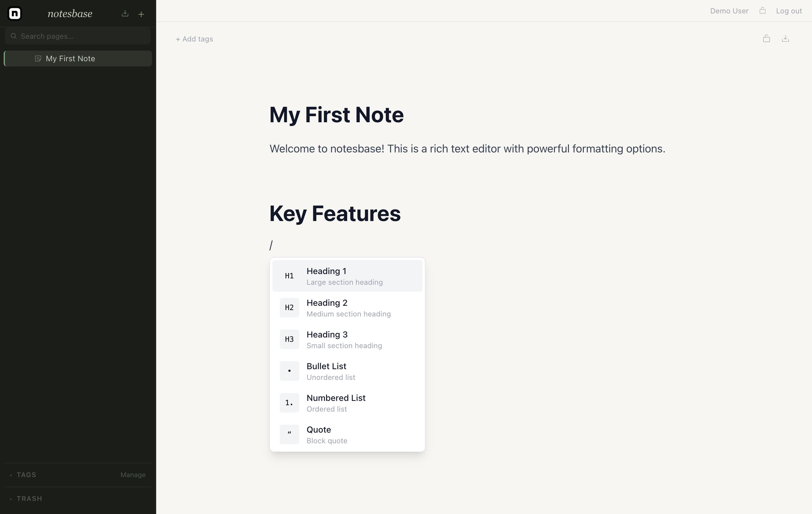

= notesbase

Vibe coded self-hosted notes app.

== Why I built this

I wanted a shared notes app I could self-host without paying per seat or trusting someone else's cloud with my data.
Notion is great but everything lives on their servers.
Obsidian is local-first but multi-user sync is a pain.
notesbase is the middle ground: simple to run, actually multi-user, with client-side encryption built into the login flow.

[cols="4*",options="header"]
|===
| | notesbase | Notion | Obsidian

| Self-hosted
| ✓
| ✗
| ✓ (local only)

| Multi-user
| ✓
| ✓ (paid/seat)
| ✗

| Client-side encryption
| ✓
| ✗
| ✗

| Setup complexity
| `docker compose up`
| SaaS
| Complex sync

| Open source
| ✓
| ✗
| ✗
|===

== Features

* Hierarchical pages with custom icons
* Rich editor - headings, code blocks, tables, callouts, lists, file uploads, inline PDFs, `+[[page mentions]]+`
* Tags & full-text search
* Client-side AES-GCM encrypted pages (keyed to your account password, server never sees plaintext)
* Multi-user with admin role; optional registration disable
* File storage via S3/MinIO
* Plugin API with scoped API keys (`pages:read`, `pages:write`, `tags:*`, `files:*`)

== Quick Start

[source,bash]
----
git clone https://github.com/pljeske/notesbase
cd notesbase
cp .env.example .env
docker compose up
----

Open http://localhost:3000 and register.
First account becomes admin.

== Stack

* Go (Gin, pgx, golang-migrate)
* React + TypeScript + Vite + TipTap + Zustand
* PostgreSQL
* MinIO (S3-compatible)
* Docker Compose / Helm

== Plugin API

Create an API key in Settings, then authenticate with `Authorization: Bearer nbp_<key>`.

[source,bash]
----
# List pages
curl -H "Authorization: Bearer nbp_..." http://localhost:8080/api/v1/plugin/pages

# Create a page
curl -X POST -H "Authorization: Bearer nbp_..." \
     -H "Content-Type: application/json" \
     -d '{"title":"My page","content":{}}' \
     http://localhost:8080/api/v1/plugin/pages
----

Available scopes: `pages:read`, `pages:write`, `tags:read`, `tags:write`, `files:read`, `files:write`.
Encrypted pages are read-only via the API (the server never holds the key).

== Roadmap

- Breadcrumbs
- Favorites / pinned pages
- Backup & restore
- Dark mode
- MCP server for querying notes
