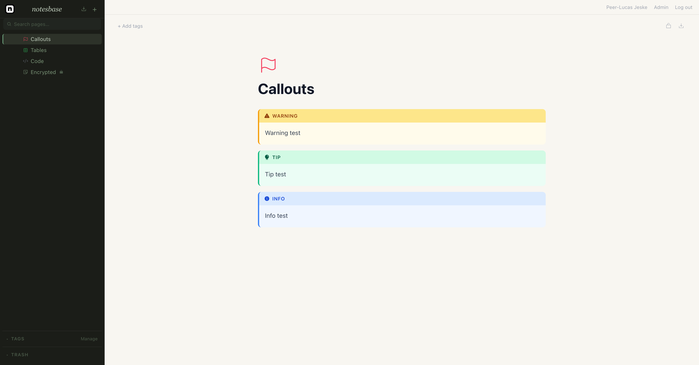
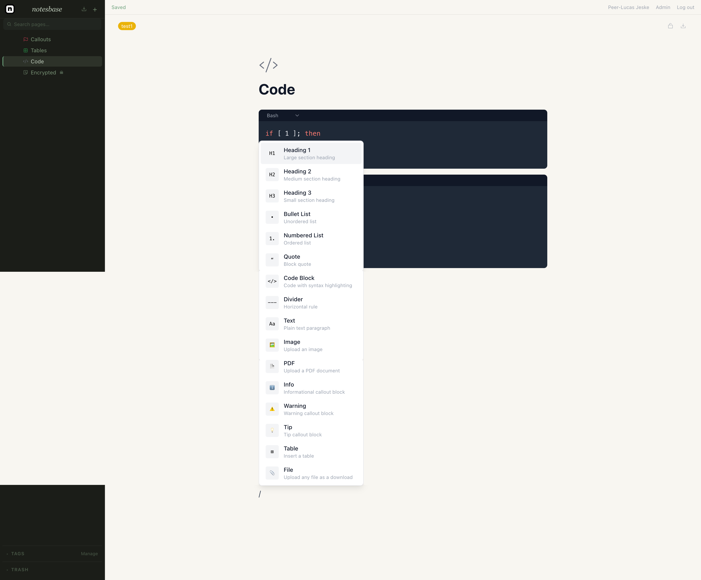
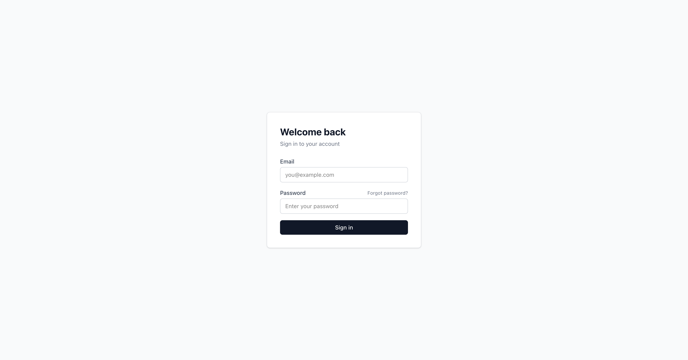
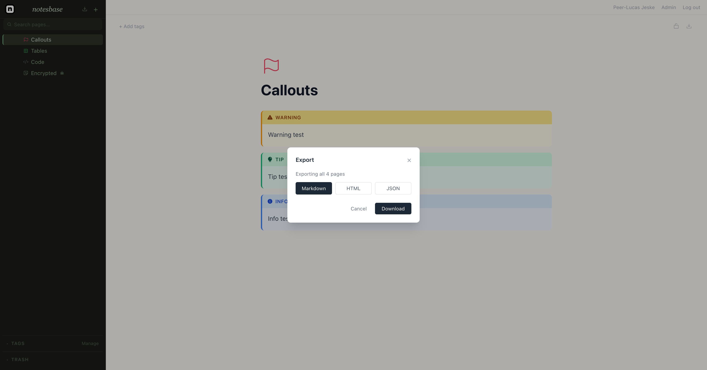

= notesbase

A (vibe coded) self-hosted, privacy-focused notes app with a rich editor, hierarchical pages, and client-side encryption.

== Features

* *Hierarchical pages* — organize notes in a tree with custom icons and colors
* *Rich editor* — headings, code blocks with syntax highlighting, tables, callouts, quotes, lists, file uploads, and `[[page mentions]]`
* *Tags* — label and filter pages
* *Full-text search* — searches both titles and content
* *Client-side encrypted pages* — AES-GCM encryption; the server never sees the plaintext
* *Multi-user* — first registered user becomes admin; registration can be disabled
* *File storage* — uploads stored in S3/MinIO

== Quick Start

[source,bash]
----
git clone https://github.com/pljeske/notesbase
cd notesbase
cp .env.example .env   # set JWT_SECRET, database and MinIO credentials
docker compose up
----

Open http://localhost:3000, register the first account (automatically becomes admin), and start writing.

== Stack

* *Backend* — Go (Gin, pgx, golang-migrate)
* *Frontend* — React, TypeScript, Vite, TipTap, Zustand
* *Database* — PostgreSQL
* *Storage* — S3-compatible (MinIO by default)
* *Deployment* — Docker Compose or Helm chart for Kubernetes

== Roadmap

=== Editor
- Rendering PDFs directly on the page

=== Navigation & Organization
- Breadcrumbs on page header
- Favorites / pinned pages

=== Search
- Advanced search filters (`tag:`, `before:`, `after:`)

=== Users & Security
- Backup and restore from backup
- Improve encrypted page workflow

=== Customization
- Dark mode

=== Integrations
- MCP server for asking knowledgebase questions
